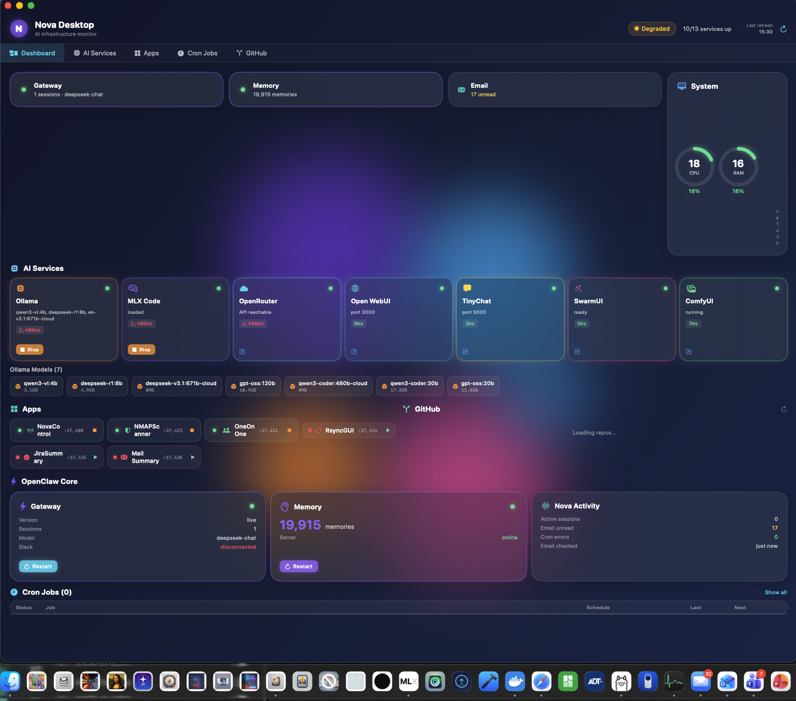

# Nova Desktop

A native macOS dashboard for monitoring and controlling all Nova AI infrastructure -- OpenClaw gateway, Ollama, MLX, running applications, cron jobs, GitHub repositories, and system resources. Built in Swift with SwiftUI, using a dark glassmorphic design language.


---



---

## Architecture

```mermaid
graph TB
    subgraph Nova Desktop
        App[Nova-DesktopApp] --> Monitor[NovaMonitor<br/>10s services / 60s GitHub]
        App --> API[NovaAPIServer<br/>NWListener :37450]
        App --> Views[ContentView<br/>5-Tab Dashboard]
        Monitor --> SC[ServiceController<br/>Start/Stop/Restart]
        Views --> Design[ModernDesign<br/>GlassCard / Gauges / Blobs]
    end

    subgraph AI Services
        Monitor -->|HTTP probe| OC[OpenClaw :18789]
        Monitor -->|HTTP probe| OL[Ollama :11434]
        Monitor -->|HTTP probe| MLX[MLX Code :37422]
        Monitor -->|HTTP probe| OW[Open WebUI :3000]
        Monitor -->|HTTP probe| TC[TinyChat :5000]
        Monitor -->|HTTP probe| SW[SwarmUI :7801]
        Monitor -->|HTTP probe| CU[ComfyUI :8188]
        Monitor -->|TCP/CLI| RD[Redis :6379]
        Monitor -->|HTTP probe| NG[Nova-NextGen :34750]
    end

    subgraph Apps
        Monitor -->|HTTP probe| NC[NovaControl :37400]
        Monitor -->|HTTP probe| NM[NMAPScanner :37423]
        Monitor -->|HTTP probe| OO[OneOnOne :37421]
        Monitor -->|HTTP probe| RG[RsyncGUI :37424]
    end

    subgraph External
        Monitor -->|REST API| GH[GitHub API]
        OC --> MS[Memory Server :18790]
        OC --> SL[Slack]
    end

    style App fill:#5535ff,color:#fff
    style API fill:#2a6,color:#fff
    style Monitor fill:#38d,color:#fff
```



---

## Features

### Real-Time Infrastructure Monitoring

Nova Desktop probes every registered service on a 10-second interval using concurrent Swift async tasks. Each probe measures reachability, latency, and service-specific metadata (loaded models, tokens per second, VRAM usage, backend counts). GitHub data refreshes on a 60-second interval to stay within API rate limits.

**OpenClaw Core:**
- Gateway health, version, active sessions, current model
- Memory server status with PostgreSQL+pgvector backend, memory count, queue depth, and /search endpoint availability
- Redis queue status (TCP-level ping via `redis-cli`)
- Slack connectivity state
- Full cron job table with status, schedule, last/next run, consecutive error count, and one-click Run Now

**AI Model Services:**

| Service | Port | Monitored Data |
|---|---|---|
| Ollama | 11434 | Online status, loaded model names and sizes |
| MLX Code | 37422 | Current model, tokens/sec, generation status |
| OpenRouter | cloud | API reachability, round-trip latency |
| Open WebUI | 3000/8080 | Running status (checks both ports) |
| TinyChat | 5000/8080/8000 | Running status (checks multiple ports) |
| SwarmUI | 7801 | Session readiness |
| ComfyUI | 8188 | Running status, total VRAM |
| Redis | 6379 | Server version via redis-cli |
| Nova-NextGen | 34750 | Active/total backend count |

**Application Health:**

| App | Port | Controls |
|---|---|---|
| NovaControl | 37400 | Start / Stop |
| NMAPScanner | 37423 | Start / Stop |
| OneOnOne | 37421 | Start / Stop |
| RsyncGUI | 37424 | Start / Stop |
| JiraSummary | 37425 | Start / Stop |
| Mail Summary | 37430 | Start / Stop |

**GitHub Repositories:**
Tracks nova, Nova-Desktop, NovaControl, MLXCode, NMAPScanner, RsyncGUI, and JiraSummary. Displays last commit message and date, open issues, open PRs, star count, and public/private visibility. Token loaded from macOS Keychain for authenticated requests.

**System Statistics:**
CPU usage, RAM percentage, disk read/write throughput, and system uptime. Data sourced from the NovaControl system stats API. Displayed as animated circular gauges with heat-map coloring.

### Service Control

Click to start, stop, or restart any monitored service directly from the dashboard:

- **Applications** launch via `NSWorkspace.shared.openApplication` and terminate via `NSRunningApplication.terminate()` with `pkill` fallback
- **OpenClaw gateway** restarts via `launchctl kickstart`
- **Memory server** restarts by killing `memory_server.py` and relaunching with nohup
- **Ollama** starts via `ollama serve` and stops via `pkill`
- **Cron jobs** run on demand via `openclaw cron run <id>`

Stop actions require a confirmation click to prevent accidental shutdowns.

### API Server

Nova Desktop runs an HTTP API on port 37450 (loopback only) via Apple's Network framework (`NWListener`). Other tools, scripts, and Nova herself can query infrastructure state or trigger refreshes.

```bash
BASE="http://127.0.0.1:37450"

curl $BASE/api/status      # overall health summary
curl $BASE/api/health      # per-service healthcheck with pass/fail
curl $BASE/api/services    # all service states + latency
curl $BASE/api/crons       # cron job list
curl $BASE/api/github      # GitHub repo summaries
curl -X POST $BASE/api/refresh   # trigger manual refresh
```

All responses are JSON. CORS headers are included for local tooling.

### Design System

Built on the [TopGUI](https://github.com/kochj23/TopGUI) design language:

- **Background:** Dark navy gradient (#0F1438 range) with five animated floating blobs using radial gradients and blur
- **Cards:** Glassmorphic panels with `ultraThinMaterial`, subtle white borders, and double shadow (dark + light inset)
- **Status indicators:** Pulsing green dots for online services, static colored dots for degraded/offline/unknown
- **Heat-map coloring:** Green below 30%, yellow 30-60%, orange 60-80%, red above 80% for CPU/RAM gauges
- **Typography:** SF Rounded design system font throughout
- **Gauges:** Animated circular gauges with spring physics for CPU and RAM
- **Latency badges:** Color-coded -- green < 100ms, yellow < 500ms, red above
- **Accent palette:** Nova purple, cyan, teal, orange, yellow, pink, green, blue -- each AI service gets its own accent color

---

## Dashboard Tabs

| Tab | Content |
|---|---|
| **Dashboard** | Top-level overview: gateway/memory/email status cards, AI services grid, apps pills, GitHub repo list, system gauges, recent cron jobs |
| **AI Services** | Full AI service cards with start/stop/open controls and scrollable Ollama model inventory |
| **Apps** | Application status pills with start/stop controls, expanded service cards in a 3-column grid |
| **Cron Jobs** | Full cron table with status icons, schedule, timing, error counts, and Run Now buttons. Toggle between error-only and full view |
| **GitHub** | Repository table with commit info, issue/PR counts, star badges, and direct links to GitHub |

---

## Keyboard Shortcuts

| Shortcut | Action |
|---|---|
| Cmd+R | Refresh all services |
| Cmd+Shift+G | Refresh GitHub data |
| Cmd+Shift+O | Restart OpenClaw gateway |
| Cmd+Shift+M | Restart memory server |
| Cmd+Shift+L | Start Ollama |

---

## Installation

Nova Desktop is distributed as a DMG installer. It is not available on the Mac App Store.

### Requirements

- macOS 14.0 (Sonoma) or later
- Apple Silicon or Intel Mac

### Install from DMG

1. Download the latest `.dmg` from the [Releases](https://github.com/kochj23/Nova-Desktop/releases) page
2. Open the DMG and drag Nova Desktop to your Applications folder
3. Launch Nova Desktop from Applications or Spotlight

### Build from Source

**Prerequisites:**
- Xcode 15 or later
- [XcodeGen](https://github.com/yonaskolb/XcodeGen): `brew install xcodegen`

```bash
git clone https://github.com/kochj23/Nova-Desktop.git
cd Nova-Desktop
xcodegen generate
xcodebuild -scheme Nova-Desktop -configuration Release build -allowProvisioningUpdates
```

### GitHub Token (Optional)

To increase GitHub API rate limits from 60 to 5,000 requests per hour, store a personal access token in macOS Keychain:

```bash
security add-generic-password -a kochj23 -s github-token -w YOUR_TOKEN
```

Nova Desktop reads this token at runtime via the macOS Security framework. Without it, the GitHub section still functions within the unauthenticated rate limit.

---

## Project Structure

```
Nova-Desktop/
├── Nova-DesktopApp.swift              App entry point, window config, menu commands
├── API/
│   └── NovaAPIServer.swift            NWListener HTTP server on port 37450
├── Design/
│   └── ModernDesign.swift             Colors, GlassCard, StatusDot, CircularGauge,
│                                      MiniGauge, ControlButton, FloatingBlob,
│                                      GlassmorphicBackground, LatencyBadge
├── Models/
│   └── ServiceModels.swift            MonitoredService, OpenClawStatus, CronJobStatus,
│                                      GitHubRepoStatus, NovaActivityStatus,
│                                      SystemStats, OllamaModel
├── Services/
│   ├── NovaMonitor.swift              @MainActor data aggregator with concurrent
│   │                                  async probes (10s services, 60s GitHub)
│   └── ServiceController.swift        Start/stop/restart via NSWorkspace, Process,
│                                      launchctl, and shell commands
├── Views/
│   ├── ContentView.swift              5-tab main window (1400x900 min), header bar
│   │                                  with overall health badge
│   ├── Components/
│   │   └── ServiceCard.swift          ServiceCard (full) and ServicePill (compact)
│   └── Sections/
│       ├── AIServicesSection.swift     AI service grid + Ollama model list
│       ├── AppsSection.swift           App status pills with controls
│       ├── GitHubSection.swift         Repo table with badges and links
│       ├── OpenClawSection.swift       Gateway, memory, activity cards + cron table
│       └── SystemSection.swift         CPU/RAM gauges, disk I/O, uptime
├── Resources/
│   └── Nova-Desktop.entitlements      App sandbox disabled for full system access
├── project.yml                        XcodeGen project specification
├── docs/
│   └── nova-dashboard.png             Dashboard screenshot
└── LICENSE                            MIT License
```

---

## Technical Details

- **Language:** Swift 5.9
- **UI Framework:** SwiftUI with AppKit integration for process management
- **Networking:** URLSession for HTTP probes (3s request timeout, 5s resource timeout); NWListener (Network framework) for the API server
- **Concurrency:** Swift structured concurrency -- `async let`, `TaskGroup`, and `@MainActor` isolation
- **Process Control:** `NSWorkspace.shared.openApplication` / `NSRunningApplication.terminate()` for apps; `Process` (bash -c) for CLI tools and services
- **Secrets:** GitHub token loaded from macOS Keychain via `security find-generic-password`; Slack token read from `~/.openclaw/openclaw.json` channel config
- **Window:** Hidden title bar, 1500x900 default size, 1400x860 minimum
- **Build System:** XcodeGen (`project.yml`) generates the Xcode project
- **Bundle ID:** `net.digitalnoise.Nova-Desktop`
- **Entitlements:** App sandbox disabled (`com.apple.security.app-sandbox = false`) for unrestricted local network access, process management, and shell execution
- **Deployment Target:** macOS 14.0 (Sonoma)

---

## How Monitoring Works

1. On launch, `NovaMonitor.shared` builds a catalog of all known AI services and applications with their ports, SF Symbol icons, and control actions (start, stop, open URL).
2. Two timers start: a 10-second timer for service probes and a 60-second timer for GitHub.
3. Each refresh cycle fires all probes concurrently using `TaskGroup`. Each probe:
   - Hits the service's health or status endpoint via HTTP
   - Measures round-trip latency in milliseconds
   - Parses service-specific metadata from the JSON response
   - Falls back to CLI tools (`redis-cli`, `openclaw status`, `openclaw cron list --json`) where HTTP is not available
4. Results are published to `@Published` properties on `NovaMonitor`, which triggers SwiftUI view updates across all tabs.
5. The `NovaAPIServer` exposes the same aggregated state over HTTP on port 37450 for consumption by scripts, Nova, and other tools in the ecosystem.

---

## Testing

Nova Desktop includes 35 unit tests across three test suites covering models, design system logic, and security compliance.

### Test Suites

| Suite | Tests | Coverage |
|---|---|---|
| `ServiceModelsTests` | 12 | All model types: ServiceState, MonitoredService, OpenClawStatus, CronJobStatus, GitHubRepoStatus, NovaActivityStatus, SystemStats, OllamaModel |
| `DesignSystemTests` | 13 | ModernColors status mapping, heat-map color thresholds (0/30/60/80/100%), boundary conditions |
| `SecurityTests` | 10 | Loopback binding port, credential scan (5 patterns across all source files), shell injection prevention, entitlements validation, Keychain token loading, Slack config file loading |

### Run Tests

```bash
cd Nova-Desktop
xcodegen generate
xcodebuild test -scheme Nova-Desktop -destination 'platform=macOS'
```

### Security Test Coverage

- Source files scanned for hardcoded API keys (sk-, AKIA, ghp_, xoxb-, xoxp-)
- Bundle IDs verified free of shell metacharacters
- GitHub token confirmed loaded from macOS Keychain
- Slack token confirmed loaded from OpenClaw config
- Entitlements confirmed: sandbox disabled for system access

---

## License

[](LICENSE)

MIT License -- see [LICENSE](LICENSE).

---

Written by Jordan Koch
