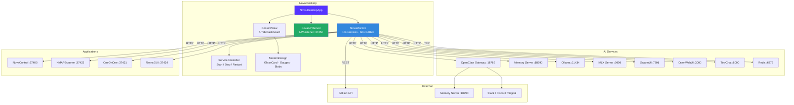

# Nova Desktop

A native macOS dashboard for monitoring and controlling all Nova AI infrastructure — OpenClaw gateway, Ollama, MLX, running applications, cron jobs, GitHub repositories, and system resources. Built in Swift with SwiftUI.


---

## Architecture


```mermaid
graph TB
    subgraph NovaDeskop["Nova Desktop"]
        App[Nova-DesktopApp] --> Monitor[NovaMonitor<br/>10s services · 60s GitHub]
        App --> API[NovaAPIServer<br/>NWListener :37450]
        App --> Views[ContentView<br/>5-Tab Dashboard]
        Monitor --> SC[ServiceController<br/>Start / Stop / Restart]
        Views --> Design[ModernDesign<br/>GlassCard · Gauges · Blobs]
    end

    subgraph AIServices["AI Services"]
        Monitor -->|HTTP| OC[OpenClaw Gateway :18789]
        Monitor -->|HTTP| MEM[Memory Server :18790]
        Monitor -->|HTTP| OL[Ollama :11434]
        Monitor -->|HTTP| MLX[MLX Server :5050]
        Monitor -->|HTTP| SW[SwarmUI :7801]
        Monitor -->|HTTP| OW[OpenWebUI :3000]
        Monitor -->|HTTP| TC[TinyChat :8000]
        Monitor -->|TCP| RD[Redis :6379]
    end

    subgraph Apps["Applications"]
        Monitor -->|HTTP| NC[NovaControl :37400]
        Monitor -->|HTTP| NM[NMAPScanner :37423]
        Monitor -->|HTTP| OO[OneOnOne :37421]
        Monitor -->|HTTP| RG[RsyncGUI :37424]
    end

    subgraph External
        Monitor -->|REST| GH[GitHub API]
        OC --> MS[Memory Server :18790]
        OC --> SL[Slack / Discord / Signal]
    end

    style App fill:#5535ff,color:#fff
    style API fill:#2a6,color:#fff
    style Monitor fill:#38d,color:#fff
```

---

## Features

### Real-Time Infrastructure Monitoring

Probes every registered service on a 10-second interval using concurrent Swift async tasks. GitHub refreshes on 60 seconds.

**OpenClaw Core:**
- Gateway health, version, active sessions, current model
- Memory server: PostgreSQL+pgvector backend, 1.48M memory count, queue depth
- Redis queue status
- Slack / Discord / Signal connectivity

**AI Model Services:**

| Service | Port | Monitored Data |
|---------|------|----------------|
| Ollama | 11434 | Online status, loaded models |
| MLX Server | 5050 | Current model, tokens/sec |
| OpenWebUI | 3000 | Running status |
| TinyChat | 8000 | Running status |
| SwarmUI | 7801 | Session readiness |
| Redis | 6379 | Server version via redis-cli |

**Application Health:**

| App | Port | Controls |
|-----|------|----------|
| NovaControl | 37400 | Start / Stop |
| NMAPScanner | 37423 | Start / Stop |
| OneOnOne | 37421 | Start / Stop |
| RsyncGUI | 37424 | Start / Stop |

**GitHub Repositories:** Tracks nova, Nova-Desktop, NovaControl, MLXCode, NMAPScanner, RsyncGUI. Displays last commit, open issues, open PRs, stars.

**System Stats:** CPU, RAM, disk I/O, uptime via NovaControl system stats API.

### Service Control

Start, stop, or restart any monitored service from the dashboard. Applications launch via `NSWorkspace`, services via `launchctl kickstart`, gateway restarts via `nova_gateway_start.sh`.

### API Server

Nova Desktop exposes aggregated infrastructure state on port 37450 (loopback only):

```bash
BASE="http://127.0.0.1:37450"
curl $BASE/api/status      # overall health summary
curl $BASE/api/health      # per-service pass/fail
curl $BASE/api/services    # all service states + latency
curl $BASE/api/crons       # cron job list
curl $BASE/api/github      # GitHub repo summaries
curl -X POST $BASE/api/refresh   # trigger manual refresh
```

---

## Dashboard Tabs

| Tab | Content |
|-----|---------|
| **Dashboard** | Gateway/memory status cards, AI services grid, apps pills, GitHub repo list, system gauges, recent cron jobs |
| **AI Services** | Full AI service cards with start/stop/open controls and Ollama model inventory |
| **Apps** | Application status pills with start/stop controls |
| **Cron Jobs** | Full 79-task cron table with status, schedule, timing, error counts, Run Now buttons |
| **GitHub** | Repository table with commit info, issue/PR counts, stars |

---

## Keyboard Shortcuts

| Shortcut | Action |
|----------|--------|
| Cmd+R | Refresh all services |
| Cmd+Shift+G | Refresh GitHub data |
| Cmd+Shift+O | Restart OpenClaw gateway |
| Cmd+Shift+M | Restart memory server |

---

## Installation

Not on the Mac App Store. Distributed as a DMG.

**Requirements:** macOS 14.0+, Apple Silicon or Intel

```bash
# Build from source (requires XcodeGen)
git clone https://github.com/kochj23/Nova-Desktop.git
cd Nova-Desktop
xcodegen generate
xcodebuild -scheme Nova-Desktop -configuration Release build
```

**GitHub Token (optional):** Increases API rate limit from 60 to 5,000 req/hr:
```bash
security add-generic-password -a kochj23 -s github-token -w YOUR_TOKEN
```

---

## Project Structure

```
Nova-Desktop/
├── Nova-DesktopApp.swift        App entry point
├── API/
│   └── NovaAPIServer.swift      NWListener HTTP server :37450
├── Design/
│   └── ModernDesign.swift       GlassCard, gauges, blobs, status dots
├── Models/
│   └── ServiceModels.swift      All model types
├── Services/
│   ├── NovaMonitor.swift        @MainActor data aggregator
│   └── ServiceController.swift  Start/stop/restart via NSWorkspace + launchctl
├── Views/
│   ├── ContentView.swift        5-tab main window
│   ├── Components/
│   │   └── ServiceCard.swift    ServiceCard + ServicePill
│   └── Sections/
│       ├── AIServicesSection.swift
│       ├── AppsSection.swift
│       ├── GitHubSection.swift
│       ├── OpenClawSection.swift
│       └── SystemSection.swift
├── Resources/
│   └── Nova-Desktop.entitlements
└── project.yml                  XcodeGen spec
```

---

## Technical Details

- **Language:** Swift 5.9 · **UI:** SwiftUI + AppKit
- **Networking:** URLSession (3s timeout) · NWListener for API server
- **Concurrency:** `async let`, `TaskGroup`, `@MainActor`
- **Secrets:** GitHub token from Keychain · Slack token from `openclaw.json`
- **Bundle ID:** `net.digitalnoise.Nova-Desktop`
- **Entitlements:** Sandbox disabled — unrestricted local network + process management
- **Build:** XcodeGen (`project.yml`)

---

## Testing

35 unit tests across three suites.

```bash
xcodegen generate
xcodebuild test -scheme Nova-Desktop -destination 'platform=macOS'
```

| Suite | Tests | Coverage |
|-------|-------|----------|
| `ServiceModelsTests` | 12 | All model types |
| `DesignSystemTests` | 13 | Heat-map thresholds, color mapping |
| `SecurityTests` | 10 | Credential scan, loopback binding, entitlements |

---

## License

MIT License — see [LICENSE](LICENSE).

Written by Jordan Koch
